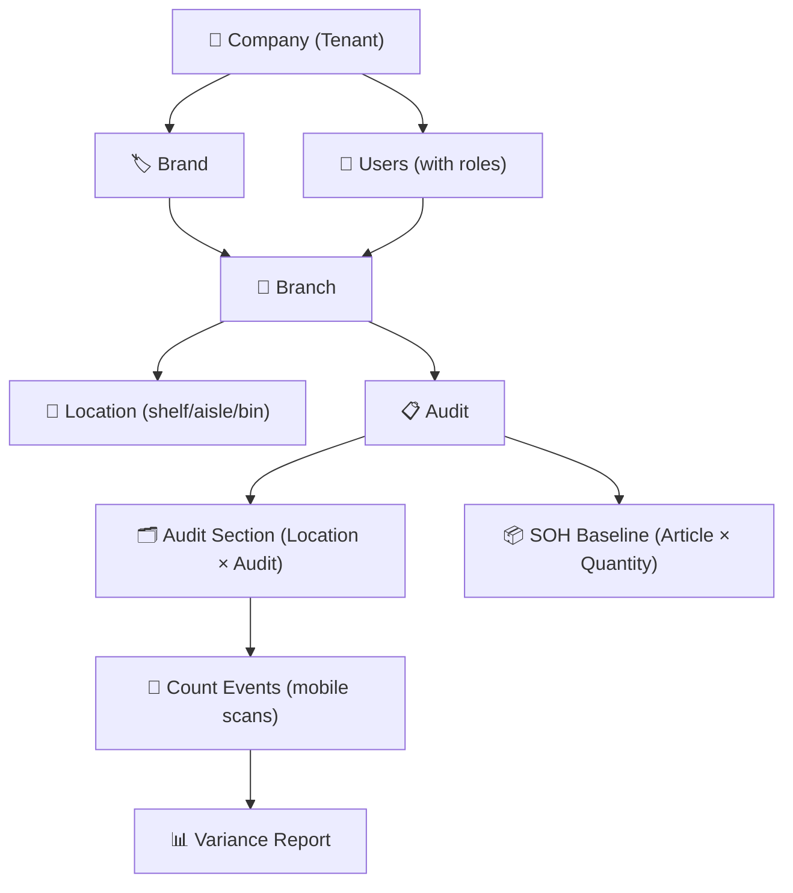

# Technical Specification: Data Import Pipeline & System Hierarchy

## Executive Summary

This spec documents the **full data hierarchy** of the StockCount platform and defines two key import features needed to operationalise a branch for an audit cycle:

1. **Branch Location Layout** — an Excel (`.xlsx`) file defining warehouse zones and shelf/location codes for a specific branch.
2. **SOH (Stock-on-Hand) Baseline** — an Excel (`.xlsx`) file mapping article codes to stock quantities, scoped to an audit.

---

## System Data Hierarchy

The entire platform is built around a strict multi-tenant hierarchy. **Every entity in the system is owned by and scoped to a specific node in this chain:**



### Hierarchy Rules
| Level | Entity | Owns / Belongs To |
|-------|--------|-------------------|
| 1 | **Company** (Tenant) | Top-level — isolated by `tenantId` |
| 2 | **Brand** | Belongs to one Company; a Company has many Brands |
| 3 | **Branch** | Belongs to one Brand; a Brand has many Branches |
| 4 | **Location** | Belongs to one Branch; imported via Location Layout file |
| 4 | **Audit** | Scoped to one Branch; a Branch can have many Audits |
| 5 | **Audit Section** | A Location within an Audit, assigned to a User |
| 5 | **SOH Baseline** | Per-item stock level for a specific Audit |
| 6 | **Count Events** | Mobile scan data; aggregated into Variance Report |

### Auth & User Scope
- Users are registered under and scoped to a **Company (Tenant)**
- Login validates credentials from the `users` DB table — **no hardcoded accounts**
- User roles determine which Branches they can access

---

> **Data Principle**: All data in the application is **dynamically driven from the PostgreSQL database via the NestJS API**. This includes:
> - **Authentication**: Login validates against the `users` DB table; registration creates a new `User` + `Tenant` row. No hardcoded credentials.
> - **Branch & Location data**: Fetched live from `branches` and `locations` tables.
> - **SOH & Audit data**: Stored in `audit_soh_baselines` and `count_events`; Variance tab reads live from DB.
> - **No static datasets** anywhere — imports write to DB, UI always re-fetches from DB.

---


## Requirements

### Functional Requirements

| ID | Requirement |
|----|-------------|
| FR-1 | Admin can upload a **Location Layout** (`.xlsx` or `.csv`) to populate `Location` records for a specific branch in the database |
| FR-2 | The layout file has the following columns: `Warehouse`, `Area`, `Zone`, `Location`, `Check digit`, `Alternative location`, `Count sequence`, `Equipment required`, `Count plan-ID`, `Count Group`, `Type`, `Behaviour` |
| FR-3 | The `Location` column maps to `location.code`, `Count Group` maps to `location.metadata.countGroup`, `Zone` maps to `location.name`, `Count sequence` maps to `location.metadata.sequence` |
| FR-4 | Admin can upload an **SOH Baseline** (`.xlsx` or `.csv`) to an existing audit — column mapping: `Article code`, `Quantity`, `Location` |
| FR-5 | Location import must be **idempotent** — re-uploading the same file must `upsert` records in the database, not crash |
| FR-6 | After import, the UI re-fetches all data from the API (no stale/static state) |
| FR-7 | Import result (rows imported, rows skipped) must be returned in the API response |

### Non-Functional Requirements

| ID | Requirement |
|----|-------------|
| NF-1 | Import must handle **Excel (`.xlsx`) as primary** format and **CSV (`.csv`) as fallback**, auto-detected from file extension. Uses `xlsx` (SheetJS) for `.xlsx` and `papaparse` for `.csv` |
| NF-2 | Blank columns, `#N/A` values, and missing optional fields must be silently skipped |
| NF-3 | Import must be scoped to a single tenant — cross-tenant writes are forbidden |
| NF-4 | Max file size: 10 MB |

---

## Architecture & Tech Stack

**Stack**: NestJS (Backend) + React + Vite (Frontend) — **no changes to tech stack**.

### API Changes

#### `POST /branches/:branchId/import-locations`
- **Auth**: `JwtAuthGuard` (tenant-scoped)
- **Body**: `multipart/form-data` with `file` field (`.xlsx` primary, `.csv` fallback)
- **New dependency**: `xlsx` (SheetJS) — `npm install xlsx`
- **Auto-detection logic** (shared utility `parseFileToRows(file)`):
  - If `file.originalname` ends with `.xlsx` → `XLSX.read(buffer)` + `sheet_to_json()`
  - If `.csv` → `papaparse` with `header: true`
- **Per-row mapping**: `Location` → `code`, `Zone` → `name`, `Count sequence` → `metadata.sequence`, `Count Group` → `metadata.countGroup`
- Auto-generates `qrValue` as `QR-{code}` if not present
- **Upserts** each `Location` by `[branchId, code]` (unique constraint)
- **Returns**: `{ imported: number, skipped: number }`

#### `POST /audits/:id/soh-baseline` (existing — upgrade to dual-format)
- **Upgrade**: Replace the raw CSV string parsing with the shared `parseFileToRows(file)` utility
- **Confirmed column mapping**:
  - `Article code` → `skuCode`
  - `Quantity` → `quantity`
  - `Location` → scope baseline to a specific location (optional)
  - `Warehouse` → optional branch code validation

### Frontend Changes

#### `Branches.jsx`
- Add a hidden `<input type="file" accept=".xlsx,.csv">` and an "Import Locations" button
- On file select, `POST` to `/branches/:id/import-locations`
- Show inline alert with result (e.g. "✅ 25 locations imported, 0 skipped")

---

## State Management & Data Flow

```
[Admin selects .xlsx/.csv file]
       ↓
[Branches.jsx] → multipart POST → [BranchesController.importLocations]
       ↓
[BranchesService] → parseFileToRows() → upsert Location[] in PostgreSQL DB
       ↓
[Response: { imported: N, skipped: M }] → UI re-fetches locations from DB → renders
```

For SOH:
```
[Admin selects .xlsx/.csv SOH file on Audit Detail page]
       ↓
[AuditDetail.jsx] → POST /audits/:id/soh-baseline
       ↓
[AuditsService] → parseFileToRows() → find Item in DB by skuCode → upsert AuditSohBaseline in DB
       ↓
[Variance tab re-fetches from DB → live comparison of SOH vs counted quantities]
```

---

## Verification Plan

### Automated (Backend)
- Run existing `test_ingestion_v2.ts` to ensure the SOH pipeline remains stable after changes.
  ```
  cd apps/api && npx ts-node test_ingestion_v2.ts
  ```

### Manual (Admin Web)
1. Log in to `http://localhost:5173` as an admin.
2. Navigate to **Branches** → open a branch → click **Import Locations** and upload the `.xlsx` layout file.
3. Verify: the "Retrieve Layout" button on a new Audit now returns those locations **from the database**.
4. Navigate to an Audit → click **Import SOH** → upload the SOH `.xlsx` file.
5. Check the **Variance** tab — data is live from DB; items should show SOH = 0 with no errors.
