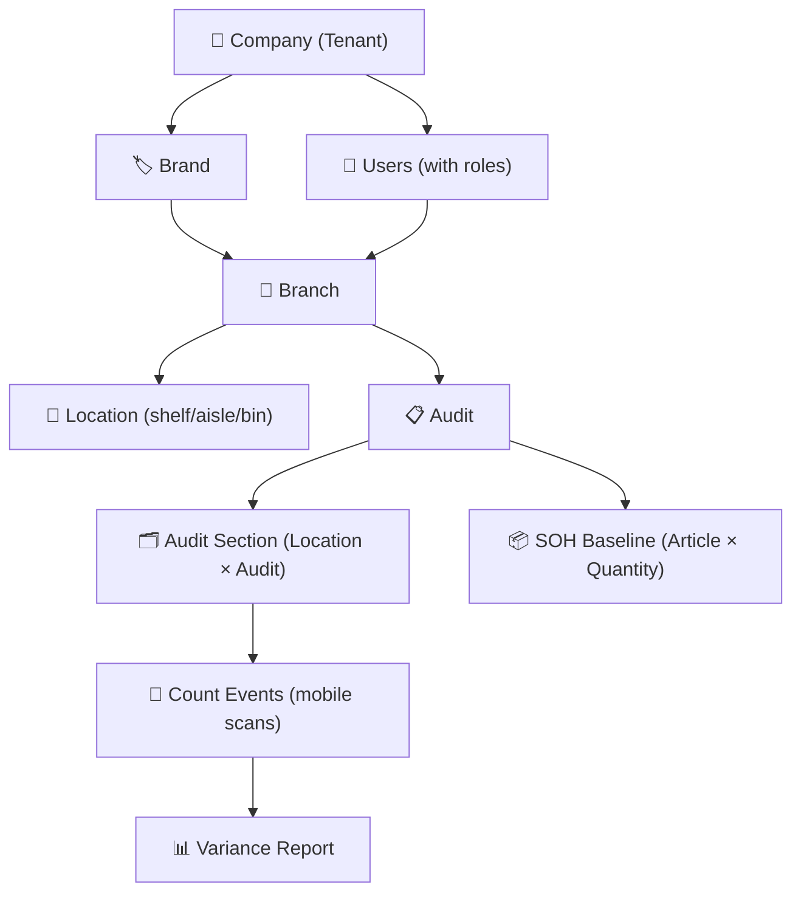

# Technical Specification: Data Import Pipeline & System Hierarchy

## Executive Summary

This spec documents the **full data hierarchy** of the StockCount platform and defines key features needed to manage the system:

1. **Branch Location Layout** — an Excel (`.xlsx`) file defining warehouse zones and shelf/location codes for a specific branch.
2. **SOH (Stock-on-Hand) Baseline** — an Excel (`.xlsx`) file mapping article codes to stock quantities, scoped to an audit.
3. **User Management** — enabling administrators to invite and manage users with specific roles and branch access.

---

## System Data Hierarchy

The entire platform is built around a strict multi-tenant hierarchy. **Every entity in the system is owned by and scoped to a specific node in this chain:**


```mermaid
graph TD
    A["🏢 Company (Tenant)"] --> B["🏷️ Brand"]
    B --> C["🏬 Branch"]
    C --> D["📍 Location (shelf/aisle/bin)"]
    C --> E["📋 Audit"]
    E --> F["🗂️ Audit Section (Location × Audit)"]
    E --> G["📦 SOH Baseline (Article × Quantity)"]
    F --> H["🔢 Count Events (mobile scans)"]
    H --> I["📊 Variance Report"]
    A --> J["👤 Users (with roles)"]
    J --> C
```

### Hierarchy Rules
| Level | Entity | Owns / Belongs To |
|-------|--------|-------------------|
| 1 | **Company** (Tenant) | Top-level — isolated by `tenantId` |
| 2 | **Brand** | Belongs to one Company; a Company has many Brands |
| 3 | **Branch** | Belongs to one Brand; a Brand has many Branches |
| 4 | **Location** | Belongs to one Branch; imported via Location Layout file |
| 4 | **Audit** | Scoped to one Branch; a Branch can have many Audits |
| 5 | **Audit Section** | A Location within an Audit, assigned to a User |
| 5 | **SOH Baseline** | Per-item stock level for a specific Audit |
| 6 | **Count Events** | Mobile scan data; aggregated into Variance Report |
| 4 | **Users** | Scoped to Company; can be assigned to multiple Branches |

---

## Feature Spec: User Management [NEW]

### Executive Summary
Administrators need the ability to add new users (Auditors and Managers) to their organization to perform audits. The User Management page should provide a centralized interface to view existing users and invite new ones.

### Requirements

#### Functional Requirements
- **FR-11**: Admin can view a list of all users belonging to their Tenant.
- **FR-12**: Admin can click "Invite User" to open a creation modal.
- **FR-13**: Add User form must include:
    - **First Name & Last Name**
    - **Email Address** (must be unique within the system)
    - **Password** (initial temporary password)
    - **Role Selection** (e.g., AuditManager, Auditor)
    - **Branch Access** (multi-select list of branches owned by the tenant)
- **FR-14**: System must hash the password before storage using `bcryptjs`.
- **FR-15**: User list must update automatically after a new user is added.

#### Non-Functional Requirements
- **NF-7**: Passwords must be hashed with a salt (rounds=10).
- **NF-8**: Email validation must be enforced on the client and server.

### Architecture & Tech Stack

#### API Changes
- **`POST /users`**:
    - **Auth**: `JwtAuthGuard`
    - **Body**: `{ email, password, firstName, lastName, roleId, branchIds: string[] }`
    - **Logic**:
        1. Check if email exists.
        2. Hash password.
        3. Create `User` in a transaction.
        4. Link to `Tenant` from request context.
        5. Create `UserRole` for the selected role.
        6. Create `UserBranchAccess` entries for each selected branch.

#### Frontend Changes
- **`Users.jsx`**:
    - Implement `UserForm` modal similar to `BranchForm`.
    - Fetch available Roles and Branches to populate dropdowns/multi-selects.
    - Add `onSubmit` handler to call `api.post('/users', formData)`.
    - Replace static placeholder data with live API response from `/users`.

---

## Feature Spec: Data Import Pipeline

### Requirements

| ID | Requirement |
|----|-------------|
| FR-1 | Admin can upload a **Location Layout** (`.xlsx` or `.csv`) to populate `Location` records for a specific branch |
| FR-4 | Admin can upload an **SOH Baseline** (`.xlsx` or `.csv`) to an existing audit |
| FR-5 | Location import must be **idempotent** — re-uploading the same file must `upsert` |

### Architecture
- **Shared Utility**: `parseFileToRows(file)` using `xlsx` and `papaparse`.
- **Endpoints**: `POST /branches/:branchId/import-locations` and `POST /audits/:id/soh-baseline`.

---

## Feature Spec: Branch Detail Page

### Requirements
- **FR-8**: Dedicated detail page for any branch (`/branches/:id`).
- **FR-9**: Display Branch Info, Parent Identity, and recursive Location Tree.

---

## Verification Plan

### Automated
1. **API Test**: Create a test script `test_user_creation.ts` to verify `POST /users` handles tenant isolation, role assignment, and branch access correctly.
   ```bash
   cd apps/api && npx ts-node test_user_creation.ts
   ```

### Manual
1. Log in as Admin.
2. Go to **User Management**.
3. Verify existing users are listed (not the static placeholders).
4. Click **Invite User**.
5. Fill details, select "Auditor" role and a branch.
6. Submit and verify the new user appears in the table.
7. Log out and try logging in with the new user's credentials.
